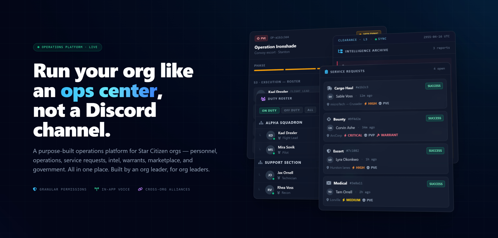

<p align="center">
  
</p>

<h1 align="center">My RSI Org</h1>

<p align="center">
  <strong>Run your org like an ops center, not a Discord channel.</strong><br>
  A self-hosted operations platform for a single Star Citizen organization — personnel, ops, dispatch, intel, fleet, and more, all in one place.
</p>

<p align="center">
  
  
  
  
  =22.12">
  
</p>

---

## What is this?

Most Star Citizen orgs run on a sprawl of Discord channels, pinned messages, and a spreadsheet someone's afraid to touch. **My RSI Org** replaces that with one self-hosted dashboard your whole org actually logs into.

One deployment runs one org. No SaaS, no per-seat fees, no data living on someone else's server. You host it, you own it.

> 🛰️ **Built by an org leader, for org leaders.**

## ✨ What's inside

| | |
|---|---|
| 🪖 **Personnel & HR** | Roster, ranks, units, positions, applications, vetting & conduct records |
| 📟 **Requests & Dispatch** | Service requests with triage, dispatch, and a live dispatch center |
| 🎯 **Operations** | Plan ops, phases & tasks, RSVPs, command boards, after-action reports |
| 🕵️ **Intelligence** | Reports, dossiers, caution notes, security clearances & limiting markers |
| 🤝 **Cross-Org Alliances** | Secure, server-to-server federation between independent instances |
| 🚀 **Fleet & Logistics** | Fleet manager, warehouse, and quartermaster |
| 🏛️ **Government & Finance** | Elections, legislation, orders, and an org treasury |
| 📖 **Wiki & Public Page** | A TipTap rich-text org wiki + a configurable public-facing org page |
| 🎙️ **In-app Voice** | LiveKit push-to-talk comms, no third-party app required |
| 🔐 **Granular Permissions** | Fine-grained roles, with the **server** as the real security boundary |

Everything updates live across clients via Supabase Realtime.

## 🏗️ Architecture

- **Frontend** — React + Vite + TailwindCSS. `App.tsx` always renders `DashboardApp.tsx`. An unauthenticated visitor gets the login screen or the optional public org page.
- **Backend** — an Express server (`server.ts`). All mutations go through a single `POST /api/services` RPC endpoint dispatched in `api/services.ts`; reads go through `GET /api/query`. The server runs under the Supabase service-role key, so the **server is the security boundary** (permission map + per-resource authz), not per-row tenant scoping.
- **Database** — Supabase (PostgreSQL + Auth + Realtime). RLS stays enabled deny-by-default so a leaked anon/auth key reads nothing.
- **Auth** — Discord OAuth. On first boot the server seeds defaults and prints a one-time **admin setup code** to its console; the first Discord login that supplies that code becomes Admin. Subsequent users self-register at the default role and are promoted by an admin.

## 🚀 Quick Start

> The full walkthrough — Supabase project, Discord app, environment variables, reverse proxy — lives in [`DEPLOYMENT_GUIDE.md`](./DEPLOYMENT_GUIDE.md).

1. **Database** — in the Supabase SQL Editor, optionally run `reset_db.sql`, then run `schema.sql` (the consolidated single-org schema). Enable the Discord auth provider.
2. **Configure** — copy `.env.example` to `.env` and fill in your Supabase URL + service-role key, `JWT_SECRET`, `SECRETS_ENCRYPTION_KEY`, and Discord credentials (LiveKit / Gemini / UEX keys are optional).
3. **Install & build**
   ```bash
   npm install
   npm run build
   npm start
   ```
4. **Claim admin** — watch the server console on first boot for the admin setup code, then log in with Discord and supply it to become Admin. 🎉

## 🛠️ Development

```bash
npm run dev       # Vite dev server (port 3000)
npm run build     # tsc + vite build + server compile
npm run lint      # ESLint (--max-warnings 0)
npm run test      # Vitest
npx tsc --noEmit  # type-check only
```

## 🧰 Tech Stack

- **Frontend**: React, Vite, TailwindCSS, TipTap, Konva, Recharts
- **Backend/Database**: Supabase (PostgreSQL, Auth, Realtime), Express
- **Realtime voice**: LiveKit
- **Deployment**: Coolify / Nixpacks on a VPS (any Node host works)

## 🔒 Security

The server is the security boundary, so we take reports seriously. Found something that looks off? Please **report it privately** — see [`SECURITY.md`](./SECURITY.md) (don't open a public issue for vulnerabilities).

## 📜 License

**PolyForm Noncommercial License 1.0.0**, with one added attribution requirement. You're free to use, modify, and share this software for any **noncommercial** purpose — run it for your org, fork it, tinker with it, self-host it. You just **can't** use it for commercial advantage or monetary compensation (nobody makes money off it).

Any fork or derivative must also keep the original author credit (**"Built by Jenk0"**) on its in-app change-info / About page. See [`LICENCE.md`](./LICENCE.md) for the full terms.

> ℹ️ This is a *source-available*, noncommercial license — not an OSI-approved open-source license, since it restricts commercial use.

---

<p align="center"><sub>Built by <strong>Jenk0</strong> · o7</sub></p>
